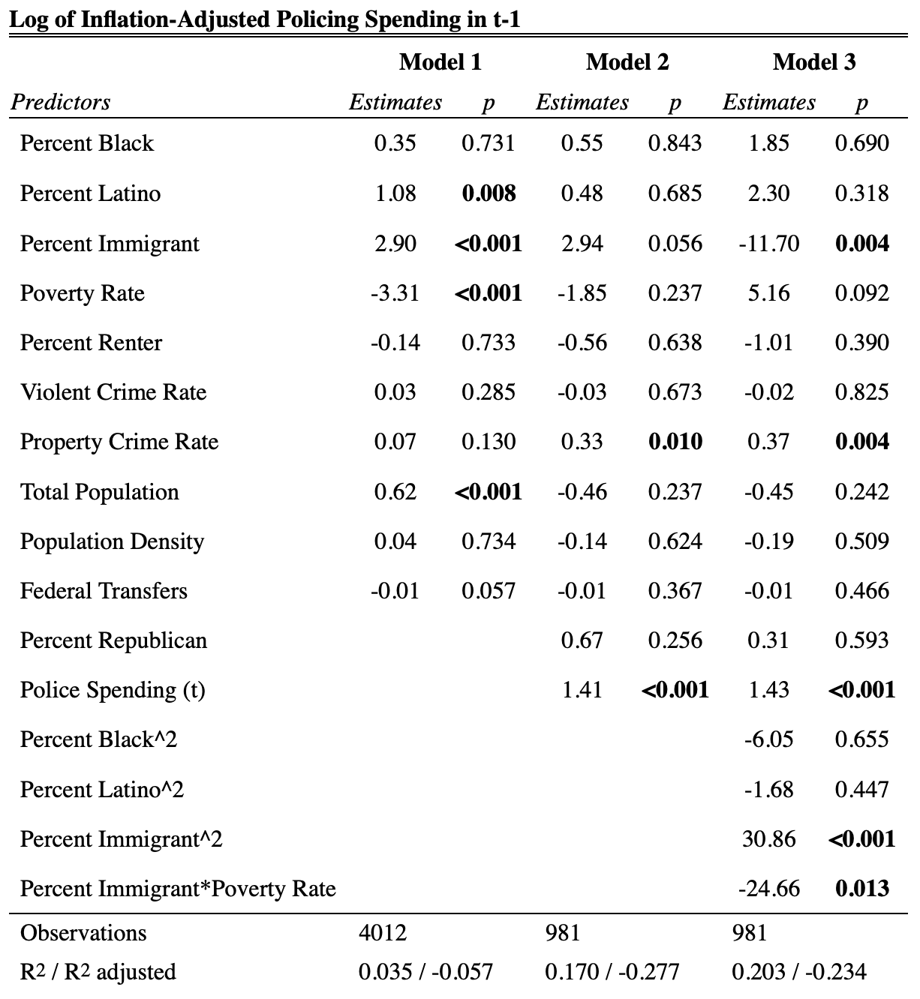

```{r setup}
knitr::opts_knit$set(root.dir = '/Users/angelmr/ps239t-final-project/')
```

## Brief substantive background / goal

During a 2008 city council meeting in an exurb north of Los Angeles, the mayor publicly declared that it was time to “go to war” against Section 8 (Kurwa 2015). The city of Lancaster in north Los Angeles County was actively and openly pursuing measures that would limit the number of voucher holders in the city. For three years, Lancaster partnered with the Los Angeles County Sherriff’s Department on an enforcement program that directed additional investigatory power toward perceived Section 8 households (Kurwa 2015:384). Following a rise in Housing Choice Voucher holders in Antioch, an exurb northeast of Oakland, the city set up a similar police task force “dedicated to patrolling voucher households and Section 8 properties, particularly among the African American population” (Kneebone and Berube 2014:53). Both cases prompted class action lawsuits that the cities eventually settled. Another more recent case, however, suggests that renters of color writ large pose threats to existing residents. In December of 2019, the U.S. Department of Housing and Urban Development filed a fair housing lawsuit against the city of Hesperia, a majority Latino exurb east of Los Angeles, which alleges that the city, with substantial support from the San Bernardino County Sheriff’s Department, enacted a mandatory “crime-free” rental housing ordinance to address a perceived “demographical problem”: the growing population of Black and Latino renters in city (Anon 2019). During a hearing on the ordinance, the all-white city council was especially fixated on the places where the newcomers were allegedly coming from, including parts of Los Angeles with large Black and Latino populations. The lawsuit contends that the city and sheriff’s department explicitly sought to expel Black and Latino renters. But are these cases aberrations or indicative of a broader trend of how communities on the receiving end of gentrification respond to demographic changes? This paper explores how policy responses, specifically policing, vary across California with a focus on inland suburban jurisdictions. It will empirically test the evidence of racial, economic, and renter threats when it comes police spending.

The persistent rise in police spending, particularly in a context of declining crime rates throughout the 1990s and 2000s, has received considerable attention among scholars. Racial threat theory is one of the most prevalent and empirically supported explanations for this growth. Proponents contend that large or growing minority populations generate increased fear of crime victimization as well as social, political, and economic threats among the white majority that lead to greater social control measures (Blalock 1973; Blumer 1958; Liska 1992). Beck and Goldstein (2018), while also finding evidence of racial threat, point instead to the growing reliance on housing price appreciation beginning in the late 1990s, what they term “housing market capitalism”, as the primary explanatory factor for ballooning police budgets. They argue that even “safe-feeling” homeowners might support expanded policing in order to protect home values (Beck and Goldstein 2018:1188). But the vast majority of studies on this topic, including Beck and Goldstein (2018), rely on samples of the nation’s largest cities, thwarting discussion of how these dynamics play out in small- and medium-sized cities, suburbs, and in places with large Latino populations. Understanding whether and how the relationship between demographic change and social control operates differently in suburbs than in core cities has significant scholarly and policy consequences.

This analysis examines the evidence of racial threat in California cities and how suburbs on the receiving end of gentrification and displacement respond to demographic changes in the context of the suburbanization of poverty (Kneebone and Berube 2014; Lacy 2016) and the resegregation of the metropolis (Samara 2016; Schafran 2018). As concentrated poverty disperses from the central city due to changes in federal housing policy as well as market forces (Kneebone 2017), people do not sort evenly into suburban communities. In fact, studies suggest a resegregation of poor people as well as Black and Latino residents in a select number of suburban jurisdictions (Kurwa 2015; Samara 2016; Schafran 2018). My primary hypothesis is that in suburban communities, where the ideology of homeownership reigns (Rollwagen 2015), what matters most when it comes to police spending is not just racial threat but the interaction between racial threat and “renter threat” (Trounstine 2018) as well as renter segregation. To my knowledge, neither measure has been included in extant research on policing, but they would bolster the housing market capitalism perspective. To answer my proposed questions, I employ a mixed methods approach drawing on survey and administrative data, in-depth interviews, and newspaper articles. The primary focus of this particular project is on the data collection and the analysis. The text analysis of articles is part of my next steps. Preliminary interviews with exurban elected officials, city bureaucrats, and police chiefs as well as suburban newspaper articles helped me to identify my primary hypotheses and will provide qualitative evidence of how the mechanisms I identify work in practice. The quantitative analysis then subjects my hypotheses to a systematic analysis. It brings together city-level police spending from the State Controller’s Office, racial composition and housing tenure data from the U.S. Census and the American Community Survey, housing price and foreclosure data from Zillow, voting data from the California Secretary of State, and crime data from the FBI’s Uniform Crime Reporting data. In this analysis, I estimate a series of fixed effects regression models for California cities from 2000 to 2018. The principle benefit of this analytic strategy is that it controls for unobserved, time-invariant differences across the sample. To test differences between the urban core and the suburban periphery, as part of my next steps, I will run separate samples.

## Collecting data

The data collection process was the most grueling because I am drawing on data from so many different sources. Each came with their own set of challenges. Even for the simpler one, like the crime rates from the FBI, they came in a CSV format but I still had to transform from wide to long then create a crosswalk for the cities to the Census GEOIDs, for example. For the Census data, I made use of the Census API and tidycensus, which is an excellent package once mobilized with the map_dfr() function that allows for calling multiple variables from multiple years in a single call.

Another issue came up with the policing data. At first, I was just going to rely on the state's ByTheNumbers [tool](https://cities.bythenumbers.sco.ca.gov/#!/year/default). But the data only go back to 2003 and I really wanted to run an analysis back to 2000. Luckily, I found another site, the [California Local Government Finance Almanac](http://www.californiacityfinance.com/index.php#SPENDING), that relies on the same source (California State Controller, Cities Annual Reports), but goes all the way back to 1992. The merging process was relatively easy but I ran into a few hiccups because the Almanac's data had some Excel formatting and reported the data in FY across two years, so I had to cross-reference with the ByTheNumbers tool to ensure I was reassigning the year variable to the correct year.

As I explain in the "03_merging_crime_zillow_vote" file, one of the alternative explanations for fluctations in police spending is the rational choice model, which posits that police spending is dependent on the crime rate. It could be either positive or negative: cities may devote more money to policing because they have a high crime rate or cities may have a low crime rate because they spend a lot of money on policing. Many studies on policing find that the crime rate is not a significant predictor of police spending, but I include the crime rate as a control variable in the analysis. I draw on data from the FBI's Uniform Crime Reporting (UCR) [Program](https://www.ucrdatatool.gov) for violent crime and property crime. Beck and Goldstein (2018) advance the housing market capitalism perspective, suggesting that a rising dependence on housing market appreciation actually explains increases in police spending. To account for this explanation, I also rely on Zillow housing market data: <https://www.zillow.com/research/data/>. Specifically, I use the Zillow Home Value Index (ZHVI) for all homes and for single-family homes as well as the Percent of Foreclosure Resales, which measures the percentage of home sales in a given month (I average over the course of the calendar year) in which the home was foreclosed upon within the previous year (e.g. sales of bank-owned homes after the bank took possession of a home following a foreclosure).

## Cleaning / pre-processing data

Cleaning the data was a bit tedious at times and occassionaly I made some minor misktakes that ended up costing me many hours to try and identify and fix. But for the most part, the challenges associated with cleaning and pre-processing had to do with the different sources, the different ways of organizing the data, the different time-frames available, and the unique identifiers.

For the sake of brevity, I will outline here the two biggest issues I had when it comes to cleaning and pre-processing:

1. Interpolating Census Data: Previously, Census data was only available every ten years. But beginning in 2005, the Census abandoned the "long form" in favor of the American Community Survey. So I have 2000 Census data but the five-year ACS data does not begin until 2009. I knew that for my analysis, I wanted to follow previous studies that interpolated inter-Census years, but I could not find a similar enough example of how to do this. I decided on the na.approx approach. But when I tried to run the analysis, the results did not look like a linear interpolation for the random group of cities that I checked. I went back and forth trying to figure out why the interpolation just stopped for some cities at like 2003 or 2004 rather than interpolating from 2000 to 2009. But the issue I found ultimately is that while the Almanac dataset referenced above was reported in a wide format, there are no missing years (even though there are missing data). But in the state's files, the city-years that are missing are just not included. So my resulting dataframe would have data for say the city of Rancho Cucamonga for 2000, 2001, 2002, 2004, 2005, etc. And 2003 would just be missing rather than identified as NA. With this structure, na.approx would just stop at 2002 and not continue interpolating to 2009. Once I identified this issue, I went back to earlier code and I used all of the Almanac's data and only relied on the state's data for 2018 (because it is not available in the Almanac's data), reran the code, and it worked!

2. Generating a panel dataframe without an duplicate id-year pairs: My main analysis requires that I tell R that my data is in a panel format. And when using the p.dataframe() function, I was getting a warning of duplicate pairs (even though) I checked the dataframe multiple times for duplicate rows via: all_data %>% nrow() and all_data %>% dplyr::distinct() %>% nrow() and also unique(all_data). Yet every time I turned it into a panel dataframe, I was alerted of duplicate rows and after running a table command to identify them, it was true: there were duplicate rows that I could not figure out how to remove. After many hours, I decided to create a new unique identifier that combined the year-id rows and then I could successfully remove the duplicates. But then, when I went to run my fixed effects model, I got another error message. I had already run a series of fixed effects models on an earlier panel data frame, but this time, it was telling me something about a "list". After some googling, I found that if I used dplyr group_by functions on it before I converted it into a panel data frame, I had to run ungroup() before converting it to a panel data frame. After running this, thankfully the plm functions worked and I was on my way.

## Analysis and visualization

My main dependent variable (police spending) has increased over time, although this increase is less pronounced when adjusting for inflation.

```{r, out.width="0.3\\linewidth", include=TRUE, fig.align="center", fig.cap=c("Policing Spending Over Time"), echo=FALSE}
knitr::include_graphics("plots/infl_adj_police_spending_boxplot.pdf")
```

As detailed in the "05_analyzing_data" file, in the bivariate analyses, the following independent variables were signficant predictors of (leaded) police spending:

* percent Latino (positive)
* percent immigrant (positive)
* percent renter (positive)
* housing prices (positive)
* property crime rate (positive)
* violent crime rate (negative)
* total population (positive)
* population density (positive)
* percent of votes for the Republican presidential candidate (negative)

My hypothesis that an interaction between percent Black and percent renter would be significant proved to be false. In fact, not even percent Black was significant in my models. After running the full model, I found that percent immigrant retains significant as does the property crime rate and the lagged dependent variable.

Given the significance of percent immigrant and the poverty rate in most of the models as well as the bifurcated socio-economic background of immigrants in the US, I thought perhaps the more important interaction was not percent Black x percent renter but percent immigrant x the poverty rate. And it turned out to be significant!

```{r, out.width="0.8\\linewidth", include=TRUE, fig.align="center", fig.cap=c("Fixed Effects Regression Results"), echo=FALSE}

```


Even though the results of the full sample (all cities with available data) are not how I hypothesized, I potentially made some interesting discoveries when it comes to immigrant threat. Even with all of the other independent variables and controls, the percent immigrant, the immigrant quadratic term, and the interaction between percent immigrant and the poverty rate retain significance.

The main finding of this analysis is the existence of an *"immigrant threat"*, especially low-income immigrants as the interaction between percent immigrant and the poverty rate is significant.

## Future work

My next steps are adding renter segregation measures back to 2000 and seeing if that changes my results as well as running the separate models for core cities versus suburbs. Over the sumnmer, I plan to finish up this analysis and write up my findings for a potential journal submission.

This chart, created in the "04_interpolating_census_data" file in Analysis, for example, shows how the percent of Black renters has declined precipitously in places like Oakland while it's jumped in exurbs like Victorville and Lancaster.

```{r}
knitr::include_graphics("plots/pblkrenters.pdf")
```

